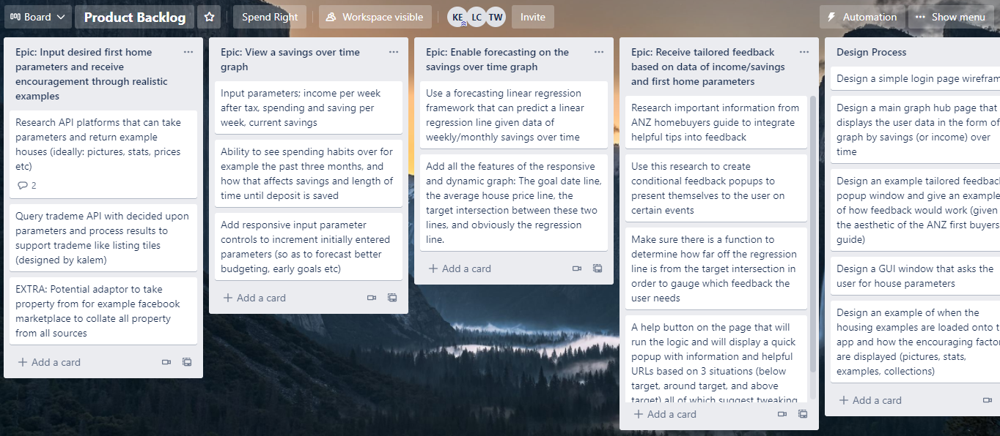
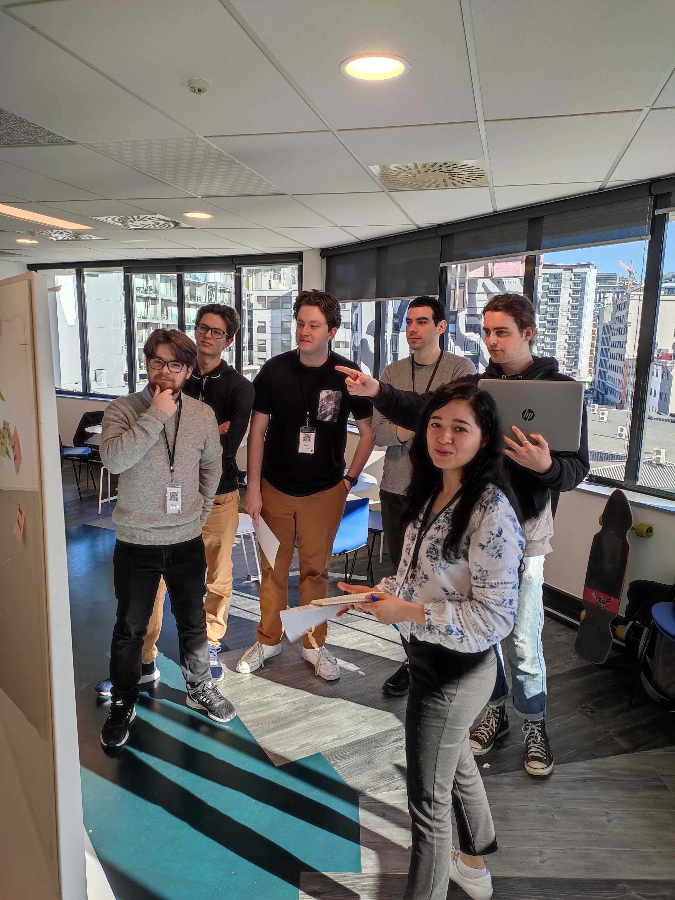

# Summer of Tech Create Camp 2021 & ANZ - Wellingon

The theme for our web-app was regarding young adults and how they might be encouraged to save for their first home. During a whole weekend we worked on solving the problem of stigma around purchasing first homes as a young adult. Our implementation works to help young adults to visualise their saving projections showing future first homes from a TradeMe API that align with their saving projections. The idea was that the saving projects could be manipulated by user interface controls to show that small changes can have big impacts in the future and that dream first homes are, in fact, achievable with good financial choices.
 
 

I played a vital role in the generation of the idea using business analysis techniques witht the team and conducting interviews with stakeholders at the event. I was also in charge of implementing the agile development management and create Scrum and Backlog boards on Trello for the team to use across the weekend. I was also in charge of implementing the wireframes to visualize how the project would look before moving to a developer role in assisting the other developers with the frameworks used to deal with the forecasting of savings and parameters to be sent to the TradeMe API.
 
 

I plan on using this repository to complete the idea alone on the foundations of what my team has built. I will make sure the program works as intended and implement a front-end to match the wireframes.

 

## Tools

- React
- VS Code
- Figma Wireframing
- TradeMe Housing API
- Trello

 

## The Team

- Business Analyst and Developer (myself)  
  [ Kalem Edlin](https://www.linkedin.com/in/kalemedlin/)  
  [ @ kalem-edlin](https://github.com/kalem-edlin)

- Lead Developer  
  [ Tian Welgemoed](www.linkedin.com/in/tian-welgemoed)  
  [ @pollie80](https://github.com/joelhilley)

- Backend Developer  
  [ Joel Hilley](https://www.linkedin.com/in/joel-hilley-5b2090136/)  
  [ @joelHilley](https://github.com/joelhilley)

- Backend Developer  
  [ Louis Cooper](https://www.linkedin.com/in/louistcooper/)  
  [ @louistcooper](https://github.com/louistcooper)

- Backend Developer  
  [ Emanuel Evans](https://www.linkedin.com/in/emanuel-evans/)  
  [ @ evansem](https://github.com/evansem)

- Frontend Developer
  [ Patricia Virgen](https://www.linkedin.com/in/patricia-virgen-422077189/)  
  [ @IngPatricia](https://github.com/IngPatricia)

 

## Extra Resources

[Link to figma Wireframes](https://www.figma.com/file/3Wz1kuK5riYYPWwGAfgSiN/SaveRight?node-id=14%3A468)

[Wireframes in PDF](SaveRight.pdf)

 
 

 
 

